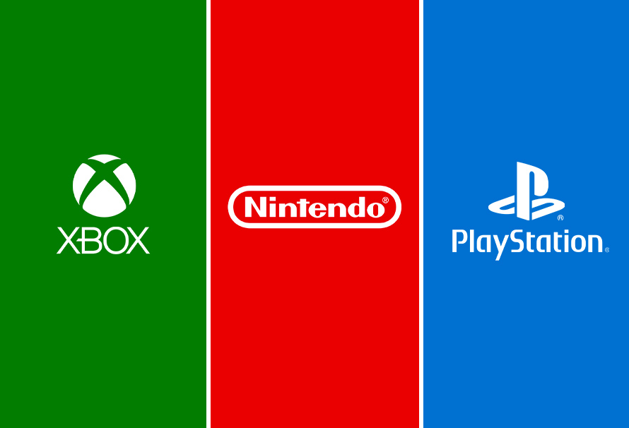

 

  

<h1> Website Overview</h1>

**Final Report** : contains a detailed report of our project including motivation, analyses, and conclusions. 

**Interactive Map**: contains an interactive map showing the top 10 best-selling video games of each company, the distribution of total sales by console, and the total sales by the release year. 

**Github repo**: click the icons at the right top corner to check our github repo. 

 

For a brief overview of our project, please view our screencast:

<*insert screencast here*>

 

<h1> Motivations</h1>

Video games are becoming increasingly popular and mainstream, a favorite pastime across a wide demographic with something out there for everyone. Currently, three major video game console developers dominate the market: **Microsoft**, which makes the Xbox consoles, **Nintendo**, which makes consoles such as Nintendo DS and Wii, and **Sony**, which makes the PlayStation consoles. Video games are released across multiple consoles, although some games can be exclusive to one console (company). Fans may also be loyal to one company for a multitude of reasons, which makes for intriguing comparisons among these three companies. 

In particular we are interested in exploring the multiple factors that influence video game sales data on the consoles made by Microsoft, Nintendo, and Sony.

 

<h1> Initial questions</h1>

* How does the sales of games change over time?

* What is the most popular/profitable game genre on each companies' consoles?

* Is there an association between critic scores and game sales? In which direction?

* Does the number of consoles the games are released on influence their sales?

 

<h1> Dataset</h1> 

We webscraped our data from  [VGChartz](https://www.vgchartz.com/games/games.php?name=&keyword=&console=&region=All&developer=&publisher=&goty_year=&genre=Action&boxart=Both&banner=Both&ownership=Both&showmultiplat=No&results=200&order=TotalSales&showtotalsales=0&showtotalsales=1&showpublisher=0&showpublisher=1&showvgchartzscore=0&shownasales=0&shownasales=1&showdeveloper=0&showdeveloper=1&showcriticscore=0&showcriticscore=1&showpalsales=0&showpalsales=1&showreleasedate=0&showreleasedate=1&showuserscore=0&showuserscore=1&showjapansales=0&showjapansales=1&showlastupdate=0&showothersales=0&showothersales=1&showshipped=0) and  [Metacritic](https://www.metacritic.com/browse/games/score/metascore/all/all/filtered?view=detailed&page=0). VGChartz is a video game sales tracking website. They produce their weekly sales estimates by extrapolating from retail sampling and trends, and regularly compares them to official shipment figures and figures estimated by regional trackers ([source](https://www.vgchartz.com/methodology.php)). Metacritic is a website that aggregates reviews of movies, TV shows, video games, and music albums. Each product is given a “Metascore”, which is a weighted average of all reviews given by critics that were curated by the site.  

 

<h1> Main findings</h1>

* **2008** is the year with the **highest global revenues** and the **most games released.**

* **Action**, **sports**, and **shooting** are the most popular and the genres that bring the most profits to the gaming companies.

* As the critic scores increase, there is a general positive correlation with the global sales. In general, **Sony** has the **highest critic score** and **highest global sales**. 

* Games with **more platform availability** indicates high popularity, tend to have **higher revenues**.  

